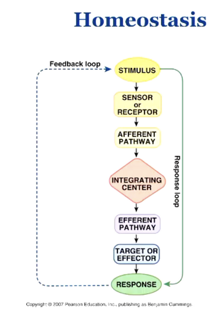

# Swift Etudes

Tom's SwiftUI experimentation spot.

## Blog

### Day 1: Haptic Image

Made a haptic image tap animation + project organisation

Learned about:
- `NavigationStack`
- `HStack`, `VStack`, `ZStack`
- `AppIcon` asset
- Image assets
- Feedback Generators (`UIImpactFeedbackGenerator`)
- modifiers
- `safeArea`

### Day 2: Palette Generator

Made a grid of rectangles colored by a random starting color and each subsequent color has a hue rotation applied.

Learned about:
- `systemIcon` (SF Symbols) - they have a cool explorer app here: https://developer.apple.com/sf-symbols/
- `ForEach` view
- `@State`
- `withAnimation` - really cool pattern. Creates an animation based on some change to a view. (e.g `selectedColor` may be set in the closure and and will have effects on other views that conditionally render based on this state. The animation will then effect all those dependent views. I have no idea how this works but it's a really nice dev experience so far.)
- `matchedGeometryEffect` modifier for animations. You can tie two views together with a unique id to enable SwiftUI to work out how to transition between two states, even if the two views are distinct.

### Day 3: HN

Made a simple HN client using their firebase API. The firebase API at `https://hacker-news.firebaseio.com/v0`. This API has some complexity as `/topstories.json` will return back a list of ids and you have to fetch each story individually. 

Learned about:
- `Alamofire` library for making HTTP requests
    - has a cool `.responseDecodable(of: Story.self)` method which can parse the json response into a struct that conforms to the `Codable` protocol.
- installing dependencies
- `@StateObject` and `@EnvironmentObject`
    - Both are for services/classes that extend `ObservableObject` like our `HNService`.
    - `@StateObject` is for when you initialize the class in the view it is being used.
    - `@EnvironmentObject` is like dependency injection. You initialize the class further up the tree and it is injected into this view
        - (claude-3.5-sonnet used the react analogy of `useContext`)
- `DispatchGroup()` for asynchronous tasks
    - create a new group
    - add a task into the group with `group.enter()` (do your request etc)
    - `group.leave()` once the task is done
        - The swift way to do this is to use `defer`, which will execute once you exit the scope of the current codeblock, regardless of errors etc.
    - `group.notify()` to inform that all of the async tasks have been completed
- `guard` I don't really understand. It feels like `guard (!isLoading) else { return }` it is the same as doing `if (isLoading) { return }` ... and just different syntax for expressing that. It might be slightly more readable? idk.
- lists
    - you can do the "pull to refresh" with `.refreshable { }` modifier

### Day 4: HN Improvements

- Swipe list to open in safari
- Sheet to open a webview with the hn story
- Render the hn score in the list

<video width="320" height="240" controls>
  <source src="./assets/3_tophn.MP4" type="video/mp4">
  Your browser does not support the video tag.
</video>

### Day 5: PID Controller

- Inspired by a physiology course I'm taking. Human homeostasis seems like a bunch of PID controllers.



- Attempted to build a PID controller in swift
- Still don't know exactly how you are meant to tune the P,I,D gain values in a PID controller?
- Learned a tiny bit about swift charts:

```swift
Chart(temperatureData) { data in
    LineMark(
        x: .value("Time", data.time),
        y: .value("Temperature", data.temperature)
    )
    .foregroundStyle(.blue)
    RuleMark(y: .value("Setpoint", self.setpoint))
        .foregroundStyle(.red)
}
.frame(height: 300)
```

- Learned about the `Timer` class ... similar to `setInterval`:

```swift
Timer.scheduledTimer(withTimeInterval: deltaTime, repeats: true) { _ in
    // do it
}
```
