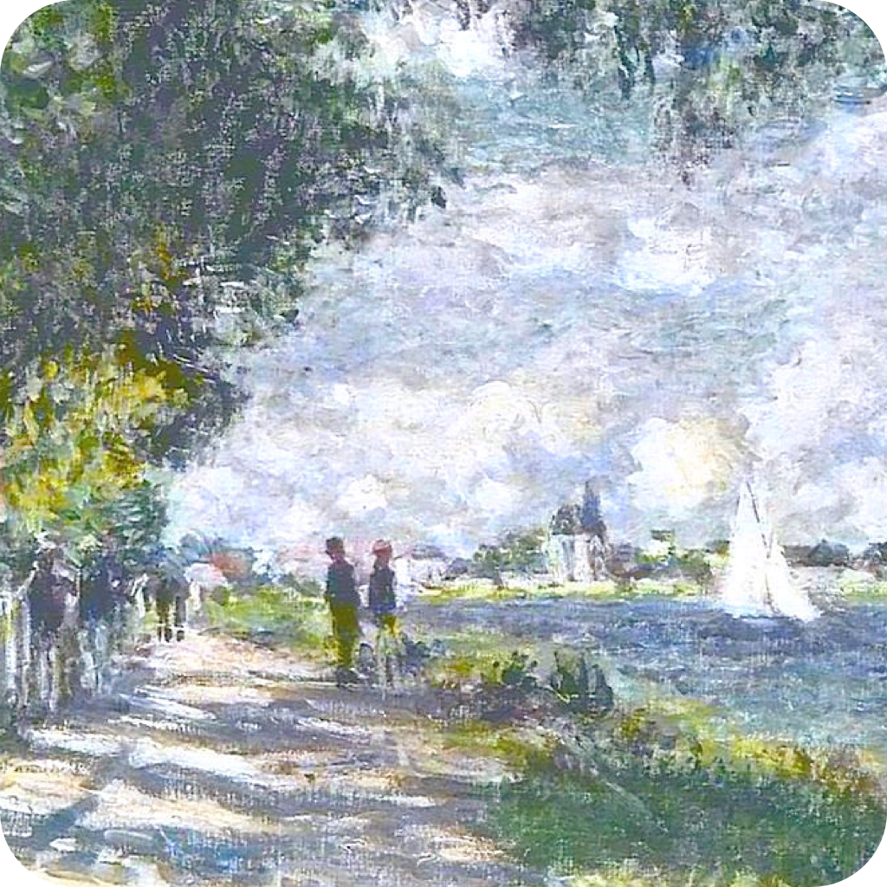

#  Swift Studies

Tom's SwiftUI experimentation spot.

## Blog

### Day 1: Haptic Image

Made a haptic image tap animation + project organisation

Learned about:
- `NavigationStack`
- `HStack`, `VStack`, `ZStack`
- `AppIcon` asset
- Image assets
- Feedback Generators (`UIImpactFeedbackGenerator`)
- modifiers
- `safeArea`

### Day 2: Palette Generator

Made a grid of rectangles colored by a random starting color and each subsequent color has a hue rotation applied.

Learned about:
- `systemIcon` (SF Symbols) - they have a cool explorer app here: https://developer.apple.com/sf-symbols/
- `ForEach` view
- `@State`
- `withAnimation` - really cool pattern. Creates an animation based on some change to a view. (e.g `selectedColor` may be set in the closure and effect some state)
- `matchedGeometryEffect` modifier for animations. You can tie two views together with a unique id to enable SwiftUI to work out how to transition between two states, even if the two views are distinct. I have no idea how this works but its a really nice dev experience so far.

